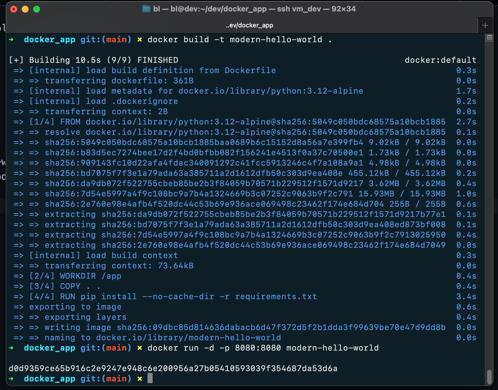
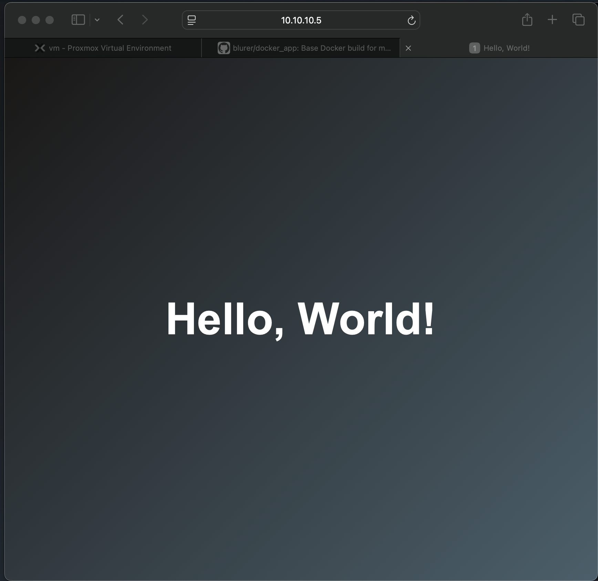

# docker_app
Base Docker build for my horribly coded webapps/scripts

# Setup
- Install Docker
- usermod -aG docker {user}
- Restart

# Run it
- git clone this repo
- docker build -t modern-hello-world .
- docker run -d -p 8080:8080 modern-hello-world

# Use it
- Open browser and go to {ip}:8080

